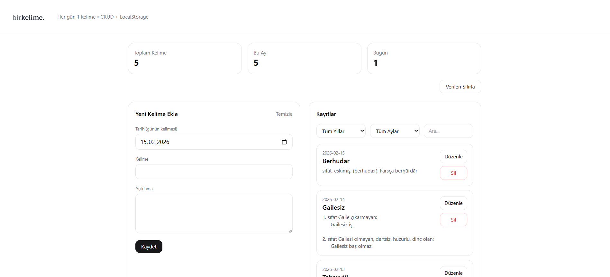

# birkelime. – Angular CRUD Projesi

## Proje Açıklaması

Bu proje, Web Geliştirme eğitimi kapsamında Angular framework kullanılarak geliştirilmiş bir frontend uygulamasıdır.  
Amaç, her gün bir yeni kelime ekleyerek kişisel bir kelime arşivi oluşturmak ve temel CRUD işlemlerini uygulamaktır.

Uygulama tamamen frontend tabanlıdır ve veriler LocalStorage üzerinde saklanmaktadır.

---

## Kullanılan Teknolojiler

- Angular  
- TypeScript  
- Tailwind CSS  
- LocalStorage  
- HTML / CSS  

---

## Uygulama Özellikleri

- Yeni kelime ekleme  
- Kelime listeleme  
- Kelime güncelleme  
- Kelime silme  
- Yıl ve ay bazlı filtreleme  
- Arama filtresi  
- Toplam kelime istatistiği  

---

## Proje Yapısı

```
src/
 └── app/
     ├── components/
     ├── pages/
     ├── interfaces/
     ├── services/
     ├── app.module.ts
     └── app.component.ts
```

---

## Kurulum

Projeyi klonladıktan sonra:

```
npm install
ng serve
```

Uygulama varsayılan olarak:

```
http://localhost:4200
```

adresinde çalışır.

---

## Build Alma

```
ng build
```

Build çıktısı:

```
dist/
```

klasörüne oluşturulur.

---

## Canlı Yayın

Proje Netlify üzerinden yayınlanmıştır.

Canlı bağlantı:  
https://softwarepersonawebao.netlify.app/

---

## Ekran Görüntüsü



---

## Amaç

Bu proje ile:

- Angular component yapısı kullanılmıştır.
- CRUD mantığı uygulanmıştır.
- Tailwind CSS entegrasyonu yapılmıştır.
- Git ve GitHub workflow deneyimi kazanılmıştır.
